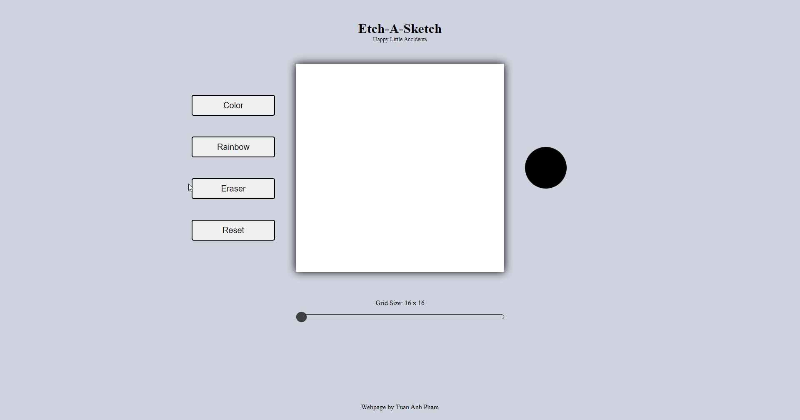

**Etch-A-Sketch**

This project is part of The Odin Project Javascript curriculum. This project enables the creation of simple pixel art.

The primary focus of this project is to practice DOM manipulation skills to influence colours of grid cells.

**Technologies:**

- Simple HTML

**Features:**

- Colour in your chosen colour or rainbow
- Eraser button and a complete board reset
- Manipulate the number of grid cells through a scoller

**Demo GIF**

